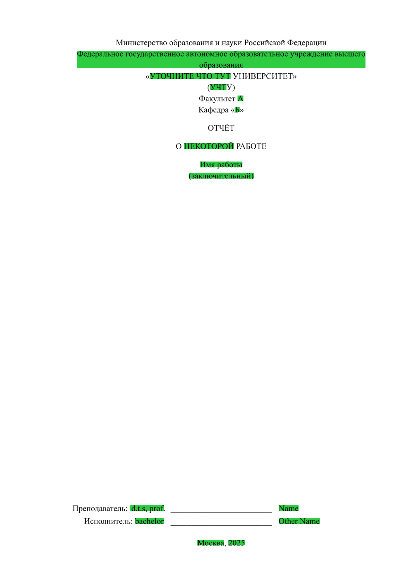

<!--toc:start-->
- [LibGost](#libgost)
  - [Exports](#exports)
  - [Usage](#usage)
  - [Screenshots](#screenshots)
<!--toc:end-->

# LibGost

A library for reports that follow ГОСТ 7.32-2017

## Exports

```typst
#let appendixes(content)
#let text-settings(pagebreaks: auto, font-size: 12pt)
#let titlepage(
  body,
  signer_1: none,
  signer_2: none,
  city: "Москва",
  year: auto,
  signer_1_honorifics: none,
  signer_2_honorifics: none,
)
#let is_appendix = state("appendix", false)
```

## Usage

Include the library:

```typst
#include("@local/libgost:1.0.0")
```

Then apply text and page settings:
```typst
#show: gost.text-settings()
```

You can also set font size in the text-settings:
```typst
#show: gost.text-settings(font-size: 14pt)
```

Now I use green fill to show what should be substituted for the real value.

```typst
#let with-blue-box(content) = {
  set box(fill: green)
  content
}

#with-blue-box(gost.titlepage(teacher: box("Name"), student: box("Other Name"), student_honorifics: box("bachelor"), teacher_honorifics: box("d.t.s, prof."), city: box("Москва"), year: box("2025"))[
  Министерство образования и науки Российской Федерации \
  #box[Федеральное государственное автономное
  образовательное учреждение высшего образования] \
  "#box[УТОЧНИТЕ ЧТО ТУТ] УНИВЕРСИТЕТ" \
  (#box[УЧТ]У) \
  Факультет #box[A] \
  Кафедра "#box[Б]"

  ОТЧЁТ

  О #box[НЕКОТОРОЙ] РАБОТЕ

  #box[Имя работы] \
  #box[(заключительный)]
])
```

Appendixes are also configured.

```typst
#show: appendixes

= Name of appendix
```

## Screenshots


